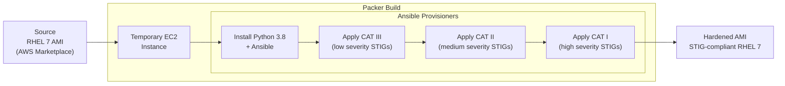

# RHEL 7 DISA STIG Image Hardening (Packer)

Packer and Ansible pipeline for building a DISA STIG-compliant Red Hat Enterprise Linux 7 AMI on AWS. Applies CAT I, II, and III security controls via Ansible roles.

## Architecture



## Repository Structure

```
├── packer/
│   ├── sources.pkr.hcl        # Source AMI definition (amazon-ebs)
│   ├── builder.pkr.hcl        # Build block + provisioner sequence
│   └── variables.pkr.hcl      # Packer input variables
└── ansible_rhel7_stig/
    ├── install_ansible.yml    # Installs Python 3.8 + Ansible on the instance
    ├── apply_stigs.yml        # Main STIG playbook (tagged by severity)
    ├── inventory              # Localhost inventory
    └── roles/
        ├── rhel7_stig/        # Main STIG role (CAT I/II/III controls)
        ├── rhel7_install_ansible/  # Ansible bootstrap role
        ├── rhel7_install_python38/ # Python 3.8 install role
        ├── rhel7_users_list/       # User enumeration
        └── rhel7_users_unlock/     # User unlock controls
```

## STIG Severity Tags

| Tag | Severity | Description |
|-----|----------|-------------|
| `high_severity` | CAT I | Critical findings — must fix |
| `medium_severity` | CAT II | Significant findings — should fix |
| `low_severity` | CAT III | Low-risk findings — good to fix |

## Prerequisites

- Red Hat Enterprise Linux 7 (other versions not supported)
- [AWS CLI](https://docs.aws.amazon.com/cli/latest/userguide/getting-started-install.html) configured with IAM credentials
- [Packer](https://learn.hashicorp.com/tutorials/packer/get-started-install-cli) installed
- [Ansible](https://docs.ansible.com/ansible/latest/installation_guide/intro_installation.html) installed

Controller host dependencies:
```
gcc, openssl-devel, bzip2-devel, libffi-devel, zlib-devel, wget, libsemanage-python
```

## Usage

```shell
aws configure

cd packer
packer init .
packer validate .
packer build .
```

To test Ansible playbooks independently:
```shell
ansible-playbook -i inventory -c local \
  --tags "low_severity" \
  --skip-tags "sudo_remove_nopasswd" \
  ansible_rhel7_stig/apply_stigs.yml
```
